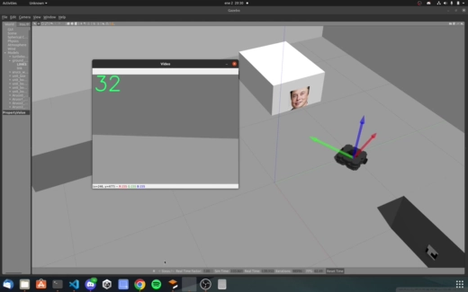
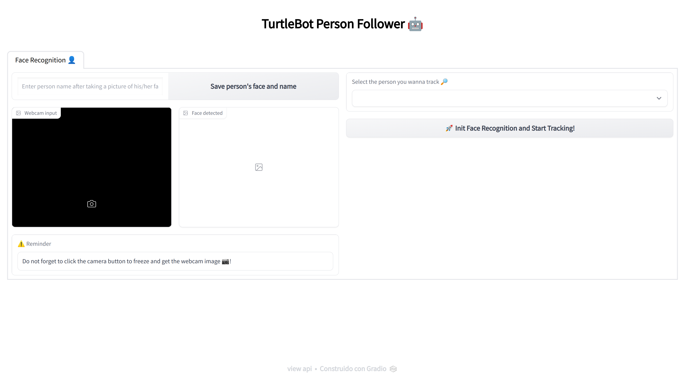

# TurtleBot Person Follower using ROS and AI 🤖

## Description:
This project is a person follower using TurtleBot and ROS. The person is detected using a pre-trained FaceNet model converted to ONNX format. The model is then used to detect the person in the camera feed and the TurtleBot follows the person. Only one photo of the person is needed to run the model.

The project was tested on Ubuntu 20.04 and ROS Noetic.

## Demo:
- Demo of the person follower in a Gazebo simulation using TurtleBot3 Waffle Pi: 


## Installation:
- ROS Noetic (http://wiki.ros.org/noetic/Installation/Ubuntu)
- python3 (https://www.python.org/downloads/)
- Install all the requirements: ```pip install -r requirements.txt```
- (Optional if have Nvidia GPU): install onnxruntime with GPU support: ```pip install onnxruntime-gpu```


## How to run:
- Clone the repository: ```git clone https://github.com/carlosabadia/turtlebot_person_follower.git ``` in your catkin workspace src folder
- Run the following commands:
```
cd ~/catkin_ws/src
catkin_make
cd ..
source devel/setup.bash
```
- To run the recognition model, run the following command: ```python3 app.py```
- To run the person follower, run the following command: ```rosrun turtlebot_person_follower follower.py```

## Recognition model ```app.py```:
- A Gradio UI will start running, then click on the link provided to open the UI on your browser.



- After the UI opens, take a selfie of yourself, enter the person's name and click on the **"Save person's face and name"** button. The image will be saved in the **"src/faces/{name}"** folder.

- Click on the **"🚀 Init Face Recognition and Start Tracking!"** button to start the recognition. The model will detect the person using the TurteBot camera feed and publish the person's name and face position on the ```/center``` topic.

- A Demo for the face recognition is available at a HuggingFace Space: [](https://huggingface.co/spaces/carlosabadia/face_detection)

- Running the UI is optional, you can also go to ```src/faces/{name}``` folder  and put a cropped image of the person's face inside. Then run ```python3 model.py```. You'll have to manually change the anchors path in the ```model.py```:

```python
# model.py

DIR = roslib.packages.get_pkg_dir("person_follower", required=True)
person_face_path = DIR + "/src/faces/Elon/" # Change this path to your folder path containing the cropped image of the person

if __name__ == '__main__':
    facenet = FaceNet(
        detector = MPFaceDetection(),
        onnx_model_path = DIR + "/src/models/faceNet.onnx", 
        anchors = person_face_path,
        force_cpu = True,
        person_name="elon.png", # Change this to the name of the cropped image of the person
    )
   
```

- The FaceNet model was modified using the following [repository](https://github.com/pythonlessons/background_removal) 

## TurleBot movement ```follower.py```:
- After running the ```app.py``` and saving the person's face, run the **follower** node by running the following command in another terminal: ```rosrun person_follower follower.py```
- The **follower** node subscribes to the created ```/center``` topic and moves the TurtleBot accordingly. Initially, the TurtleBot will begin to rotate until it detects the person.
- When detected, the TurtleBot will move forward if the person is in the center of the camera feed, it will turn left if the person is on the left side of the camera feed and it will turn right if the person is on the right side of the camera feed. The TurtleBot will stop if found any obstacles in front of it.
- The state machine was implemented using the ```smach``` library (http://wiki.ros.org/smach).

- You may also have to allow executable permissions. To do so, run the following command: ```chmod +x follower.py``` and ```chmod +x follower_turtlebot2.py```

## Notes:
- This project was also tested on the real TurtleBot2, run ```rosrun person_follower follower_turtlebot2.py``` to use it on the real TurtleBot2. The ```app.py``` stays the same.

## Authors:
- [Carlos Abadia Cutillas](https://github.com/carlosabadia)
- [Jose Antonio Castejón García](https://github.com/thefailex)

